Battleships Blast - An Interactive Online Game of Battleship
==================================

* * *

ABOUT THE WEBSITE:
------------------

* * * 

[Link to deployed site](https://battlefields-blast.herokuapp.com/)

_Battleships Blasts_ is an online game of the classic game of Battleships. The player is presneted with a 5 x 5 grid where 5 hidden battleships are randomly generated by the computer. The player has 15 missils to sink ALL ships and defeat the enemy!

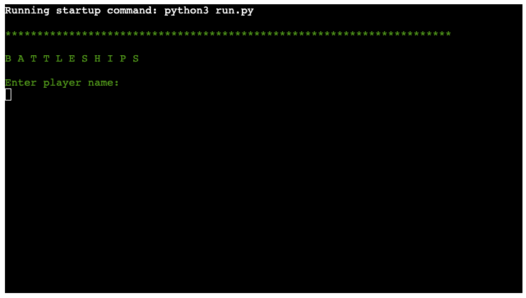

* * * 

## TARGET AUDIENCE:

* * *

This online interactive game targets all ages 10+, and that is its beauty! Almost anyone can appreciate a good strategic game of Battleships.

*   Children 10+
*   Adults

  
* * *

USER STORIES:
-------------

* * *

1. The site is designed in a way that makes the game cool, strategic but easy to play.
2. The game feels personal as the user can input their name and see it displayed throughout.
3. The game instructions are clear and concise and can be easily accessed at the start of the game.
4. The user can exit the game at any time.
5. The game displays a cool, clear grid where the user can visually see their battlefield.
6. The game grid is updated with every round, visually portraying hits and misses, and the user is provided with valuable information: 
    1. Message confirming hit, miss or duplicate hit.
    2. Missils left.
    3. Option to launch next misile or exit game.
7. The user will want to play agin and again!

* * * 

STRAGETY:
---------

* * *

Create a cool and strategic looking, yet easy to navigate interactive game of Battleships that allows the player to play against the computer who will generate its hidden ship coordinates at random. 
The user will have a set number of missils, and the results will be displayed throughout the game. Once all missils have been launched (or the user manages to sink all ships) the game will display the Game Result, and allow for the option to _Play Again_.

The site aesthetic is very simple, retro 80's PC: as it is all on the terminal I wanted to keep it with the classic old school green font,
Create a code that is clear and allows to update with ease. The game can be eaisly navigated by the user!

* * * 

STRUCTURE:
----------

* * *

### Initial Game Load

* * *

#### _Header - Game Title_

*   The Game title is displayed as soon as the game is launched. Minimalist uppercase green font: B A T T L E F I E L D S
*   Player name is requested, which will be used thoughout the game.

* * * 

### Menu Selection 

* * *

The initial M E N U section is simple, to the point and consists of 3 navigation options:

* 1 : Game Instructions
* 2 : Launch Game
* 3 : Exit Game

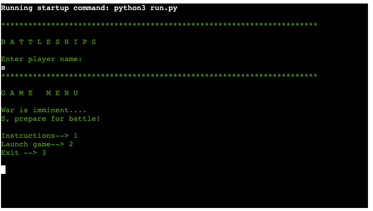

* * * 
  
### Game Instructions 

* * *

When typing 1 into the terminal, the user is directed to this page consisting of game instructions.

* Ths contains a header labelled I N S T R U C T I O N S. All section headers are displayed in a similar style (uppercase, gaps in between letters)
* The instructions which are:
    * Clear and consise
    * Arranged in bullet points
    * Separated into relevant sections.
*The user must type M to return to the M E N U.

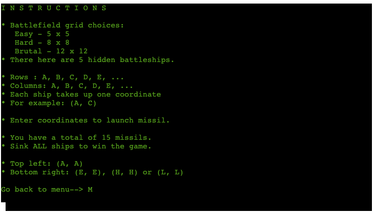

* * * 

### Exit Game

* * *

From MENU, when typing 3 into the terminal, the user is directed to the EXIT GAME section.

* This contains a header labelled QUIT GAME.
* A few lines which aim to convince the user to stay on. The language challenges the user.
* 2 options (user must type selection):
    * Y to quit now : which leads to GAME OVER
    * N to play game : which directs the user back to MENU

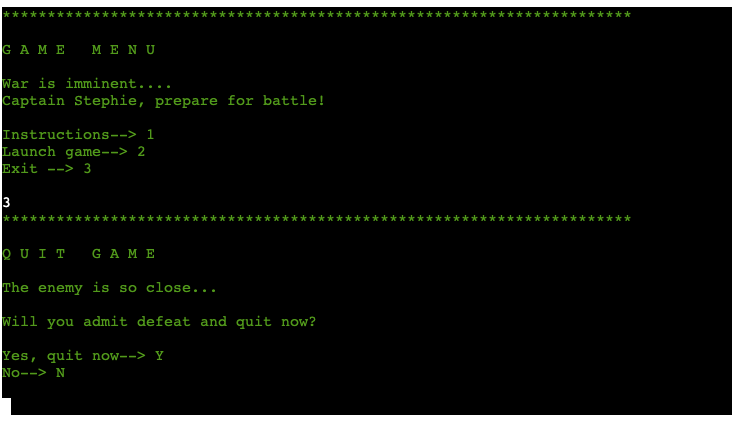
  
* * * 

### Game Over 

* * *

From Q U I T  G A M E, when typing Y into the terminal, the user is directed to the G A M E  O V E R section

This section simply displays the words G A M E  O V E R.

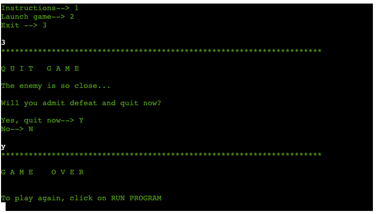

### Grid Choice 

* * *

From MENU, when typing 2 into the terminal, player is navigated to Grid choice section

* 5 x 5 --> 5
* 8 x 8 --> 8
* 12 x 12 --> 12
* Enter user selection.

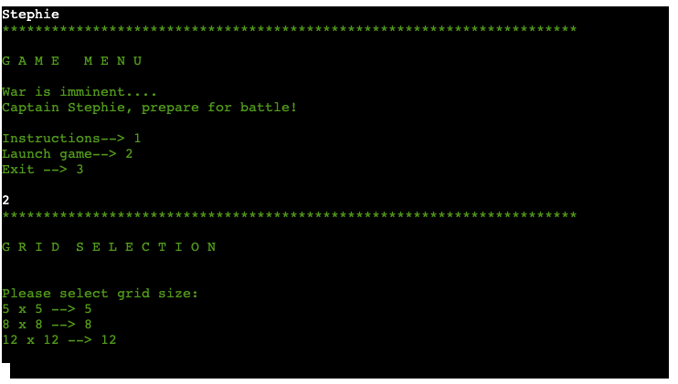

* * *

### Launch Game Rounds

* * *

From grid selection, the user is finally directed to the GAME section.
This displays:
* Header labelled T H E  B A T T L E F I E L D
* The board grid:
    * 5 x 5, 8 x 8 or 12 x 12
    * Rows: A B C D E ...
    * Columns: A B C D E ...
    * Each cooridnate is represented by a .
* Enter ROW input
* Enter COLUMN input

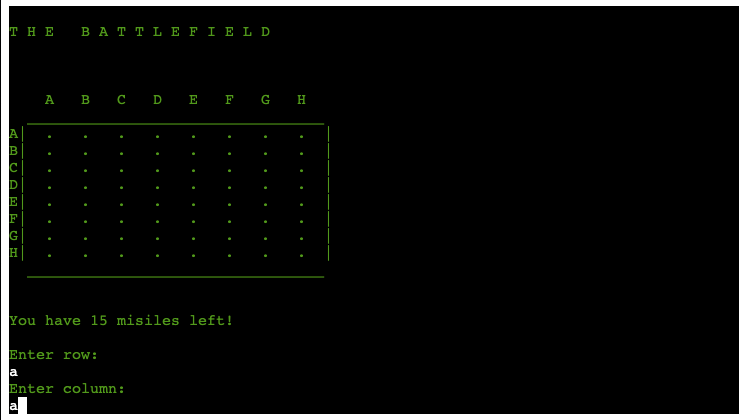

Once the user inputs both coordinates, the following options:
* Result: 
    * You sunk a ship!
    * You missed!
    * You've already hit this target, Try again!!
* Selection: Launch next misile?    
    * Y - yes --> next round
    * N - No (And a reminder, that if quiting, all advances will be lost)

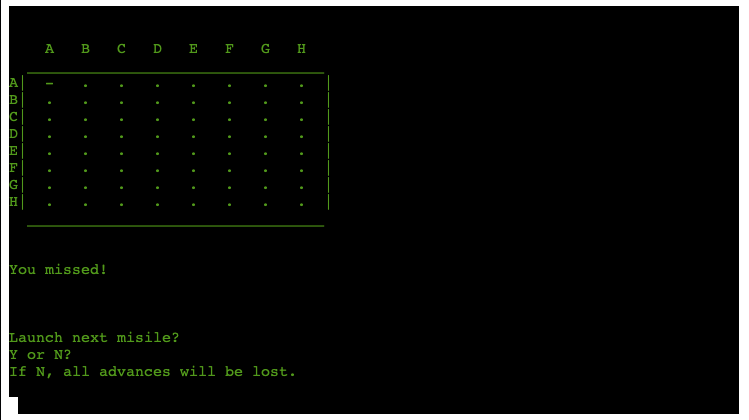

If selecting N, the user is directed to EXIT GAME section.

* * *

If selecting L:

The layout remains the same.
The grid has been updated.
The coordinate previously selected will have:
* "X" - hit ship
* "-" - miss

## SKELETON:

-----------

### WIREFRAMES:

* * * 

## THE CODE:

* * *

Prior to commencing to write my code out, I planned out the functions required.

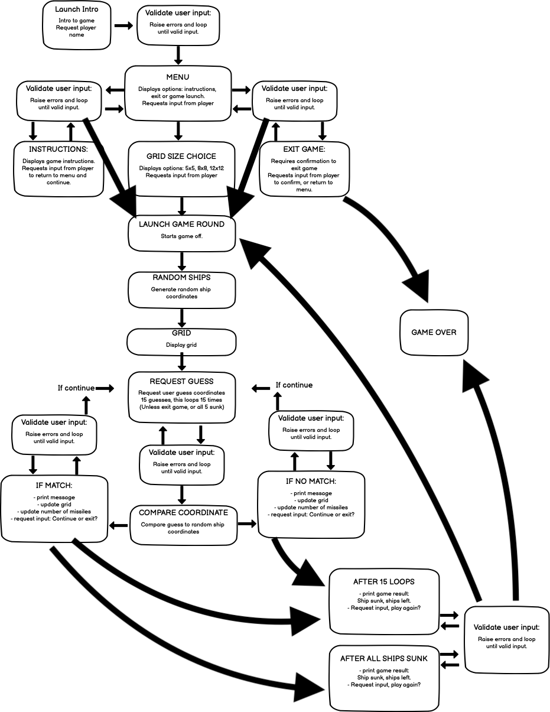

* * * 

## SURFACE:

* * *
* When initially planning this game, knowing it would be ran in a terminal only i knew it would be minimalistic.
* Before starting, I created the wireframes displayed above. I knew I wanted the game to be minimal, retro 80's PC style.

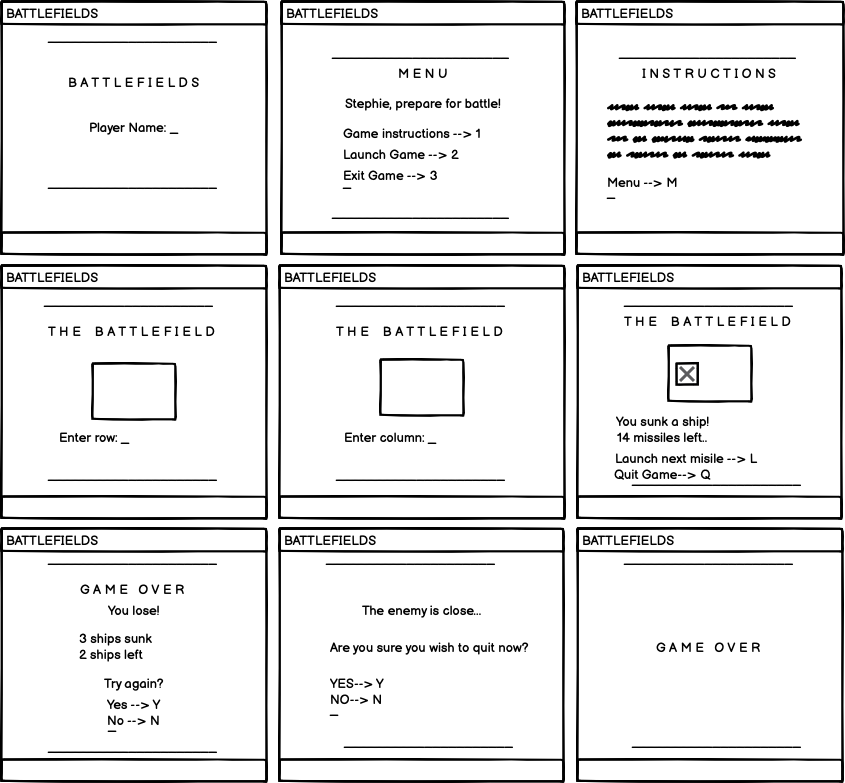
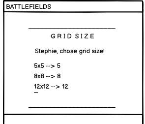

* * *

### Colors

* * *

 When discovering more python packages, I decided to incorporate termcolor to add a pop of color to my terminal.
 I decided to go with a retro, 80's style console and incorporated a GREEN font.

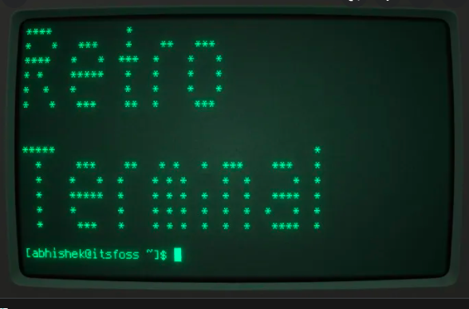

* * * 

### Typography

* * *

Using the standard console typography: but played around with a few things
* Use of spacing in headers : H E A D E R
* Use of "************" for page break and separation

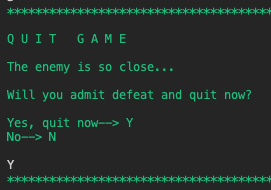

### Images and Icons

* * *

No use of image or icons.
Everything was built using letters, numbers, typographical symbols and punctuation to create the grid.

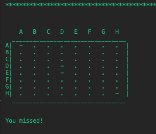

* * * 

FEATURES:
---------

* * *

### Current features

*   INTRODUCTION: This is the page that initially loads when you first arrive to the site. 
    * Header: "B A T T L E F I E L D S"
    * Player name input form (required, and validated before submitting):
        This name is stored as a variable and used a number of times throughout the game. These personalised messages create a sense of familiarity with the user.

  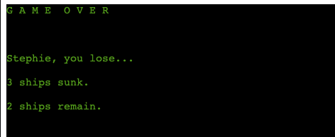 
  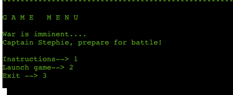 

*   MENU: which loads once the user has input player name and it has been validated. The form takes the players name and uses it below.
    * Header: M E N U
    * Personalised message to prepare for battle
    * 3 options:
        * Instructions - 1
        * Launch game - 2
        * Exit game - 3
    * Play input request: loops user input request until validated. I created a validating function to anticipate any errors the user may input:
        * Must be in a predetermined list with vaues: 1, 2, 3
        * Must be a digit
    

 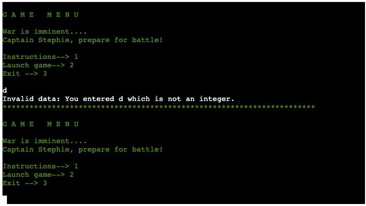 

*   INSTRUCTIONS - when entering 1
    * Header: I N S T R U C T I O N S 
    * Listed game instructions in bullet points
    * Separated by spaces to make rules clearer.
    * Instruction to enter M - go back to menu
    * Player input request. (Validated before redirecting). This looped request until validation anticipates the following possible errors:
        * Must be 1 digit
        * Must be M only

 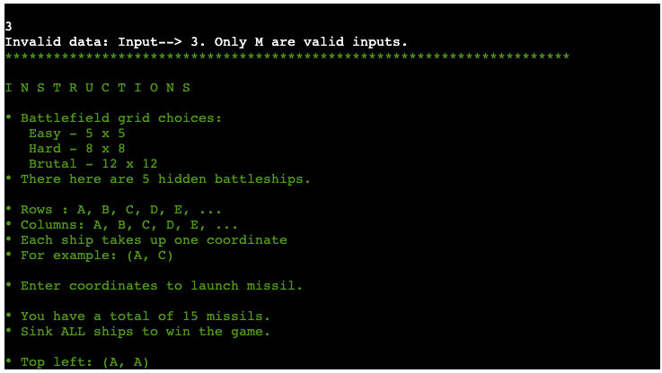 

* QUIT GAME - when entering 3 from MENU
    * Header: Q U I T  G A M E 
    * Message confirming if user wnats to exit game. Language is challenging the user.
    * Question player. Quit game?
        * If Y - GAME OVER
        * If N - back to MENU
    * Player input request. (Validated before redirecting). This looped request until validation anticipates the following possible errors:
        * Must be alphabetical
        * Must be in predetermined list with values: Y, N

 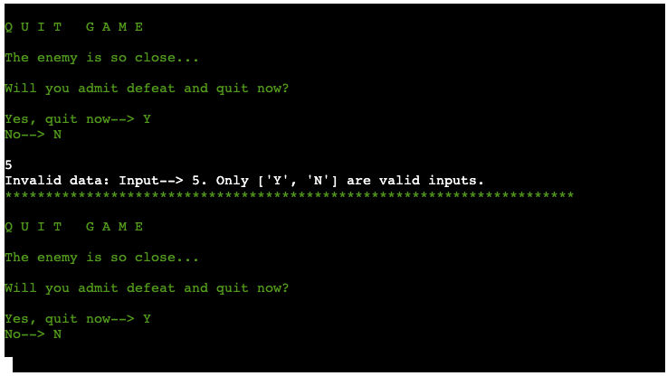 

* GAME OVER - when entering Y from QUIT GAME
    * Message displaying G A M E  O V E R

  

* GRID SELECTION - when entering 2 from MENU
    * Message displaying G R I D  S I Z E
    * Options to select from:
        * 5 x 5 (easy)
        * 8 x 8 (medium)
        * 12 x 12 (hard)
    * Input request (validated before submitting). This looped request until validation anticipates the following possible errors:
        * Must be in a predetermined list with vaues: 5, 8, 12
        * Must be a digit

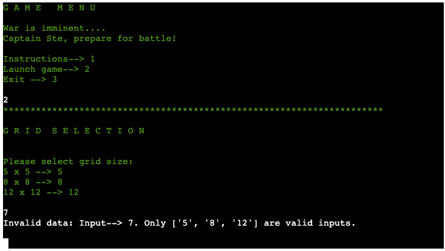 

* LAUNCH GAME ROUND - after selecting grid size
    * Header: B A T T L E F I E L D
    * Battlefield Grid:
        * Rows: A B C D E ...
        * Columns: A B C D E ...
    * Input request: Enter row (validated before submitting)
    * Input request: Enter column (validated before submitting)
    Both cases, request is looped until validation anticipates the following possible errors:
        * Must be alphabetical
        * Must be in predetermined list with values determined by for loop with range(grid_size) which creates an alphabetical list to cover this range.

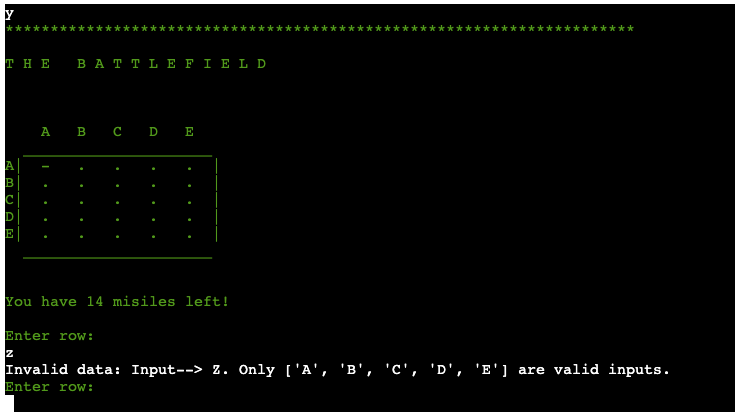 

* AFTER SUBMITTING COORDINATES - results added!
    * Message confirming hit, miss, or repeated coordinate.
    * Options, launch next misile?
        * Y - yes (validated before submitting)
        * N - no (validated before submitting)
    * Player input request. (Validated before redirecting). This looped request until validation anticipates the following possible errors:
        * Must be alphabetical
        * Must be in predetermined list with values: Y, N

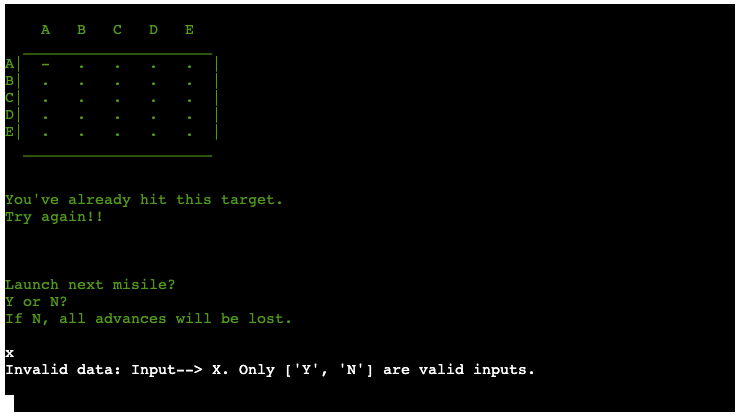 

* 2nd ROUND ONWARDS...
    * Exactly the same as before but adding:
        * Misils left! with each round that loops, the function addss 1 missil, and subtracts that value from the total misiles at the start.
        * X (sunk) or - (missed) on grid where player has previously hit.

 
    

* END SCORE (Either after completing 15 rounds, or having sunk all ships)
    * Header: G A M E  O V E R 
    * Personalised message: You win or You lose!
    * Number of ships sank
    * Number of ships remaining
    * Options, play again?
        * Y - yes (validated before submitting)
        * N - no (validated before submitting)

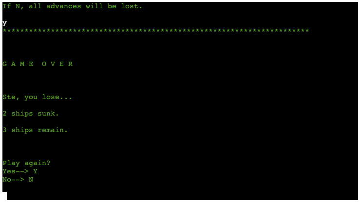 

* * * 

### Future features

* Have 2 grids: one for the player to have their ships.
* Allow player to select where to place their ships,
* Longer ships ocupying more coordinates.

* * * 

## LANGUAGES:

* * *

*   PYTHON

* * * 

## OTHER TECHNOLOGIES, FRAMEWORKS & LIBRARIES:

* * *

*   [GitHub](https://github.com/)
*   [GitPod](https://www.gitpod.io/)
*   [Heroku](https://id.heroku.com/login)
*   [Stack Overflow](https://stackoverflow.com/)
*   [Code beautify](https://codebeautify.org/html-to-markdown)
*   [Balsamiq](https://balsamiq.com/wireframes/desktop/#)
*   [Pep8](http://pep8online.com/)

* * * 

## TESTING, BUGS & FIXES:

* * *

For testing I used the following sources:

* * * 

### Tests

* * *

#### [Pep8](http://pep8online.com/)

Tested and no errors found.
Warnings:
* The empty headers are for spaced that will be filled out using Javascript code
* The section area warning suggesting a h2-h6 element: I don't think the form needs a header as it is pretty self explanatory.

* * *

#### Manual testing 

* * * 

* Initial page loads properly.
* Player name input is loaded properly and the valid input is required to move forward. 
* handlePlayerName() function works correctly, and takes the player name placing it under the players Rock,Paper,Scissors image on display during the rounds.
* All images load properly and are fully visible to the user.
* Nav bar is always visible and footer is fixed always displayed at the bottom of the screen and fully visible.
* The site has responsive design, allowing the website and its features to be fully displayed (visible) on all display sized: phone, tablets, laptops, larger screens.

* * * 

###### BUGS & FIXES: 
* The gameOver function was getting quite heavy and becoming problematic particularly in displaying block and none. A tutor at code institute recommended I  use the an onload instead. This made things run much smoothly.

* While validating my JS for bugs, I encountered a BIG problem regarding my end result. I thought I had tested it enough, but noticed that once in a while the final result displayed would be incorrect! See below:

What was happening was that the result for Round 4 was being read to come up with the final answer. Upon getting assistance from the Code Institute mentors, we discovered that there the easiest option would be to switch the order of the functions run within the playRound(e) function. We would instead place updateRound() at the ends of the function. This fixed the issue.

* I noticed that during the Game rounds, the user was having to scroll down to see their result. For this reason, I decided to remove the header (Rock paper Scissors title) from the display (between rounds 1 and 5). I initially tried to change the font and button sizes, but I thought it all looked a bit too crowded. Due to deadlines, removing the header seemed to be the best way to solve this problem (for now.. I will be working on this in the future)!

* * * 

#### Testing User Stories 

* * * 

1. The site is designed in a way that makes the game fun and easy to play.

YES! The styling of the site is simplistic and fun. The buttons and big and bright, and are styled when being hovered over. The page displays images of rock, paper and scissors when called upon. The images are big and bold. The rounds are clearly labelled and the results clearly displayed. It is easy for the user to Refresh the game and play again and again!

 

 

2. The game feels personal as the user can input their name and see it displayed throughout.

YES! The player is able to input their name into an initial form. This is required to play the game. That name is then displayed at the bottom of the user's selection. the use of this tool makes the game personal!

 

3. The game rounds and scores are displayed throughout. 

YES! Both are displayed clearly throughout the rounds.

4. The user will want to come back for more!

This game is fun, easy to play and can be easily replayed after 5 rounds. Its styling is simplistic and fun which will leave the player wanting to come back!

* * *

## DEPLOYMENT:

* * *

### Forking The GitHub Repository

* * *

You can Fork the Repository. This makes a copy of the original repository on our Github account so you can make changes without affecting the original repository.
1. Log into GitHub and locate the GitHub repository you want.
2. Click on the "Fork" button which is located in the top right corner.
3. You will now have a copy of the original repository in your GitHub account.

* * * 

### Cloning the Project.
* * *
1. Log into GitHub and locate the GitHub repository you want.
2. Under the repository name, click "Code" button which will come up with a dropdown menu.
3. Where it says Clone, copy the link below.

* * * 

### Using Code Institute's mock terminal for Heroku

* * *

This site was deployed using the following steps:

1. Make sure that the project has been created using Code Institute Python template.
2. Make sure all python scripts have a need line character at the end of the text inside.
3. With installing packages type in command: 'pip3 freeze > requirements.txt'. This will allow them to work in Heroku, and the Code Institute template will be updated automatically.
4. Commit and push changes to GitHub
5. Create Heroku Account
6. In Heroku dashboard: go to Create new app.
7. Give your app a unique name
8. Select region
9. Click create App.
10. Go to Settings tab, scroll down to Config Vars abd select Reveal Config Vars.
11. Confid Vars enter:
    1. Key: PORT
    2. Value: 8000
12. Go to Buildpacks and click Add Buildpack.
13. Select Python and save changes.
14. Add NodeJS and save changes (Python on top and NodeJS below. You can drag the to re-order)
15. Scroll to Deploy Tab, select Github and confirm Connect to Github.
16. Search for your repository and click Connect.
17. Select Deploy Branch and deploy in master/main.
18. Your deployed app is live!

[Link to deployed site](https://battlefields-blast.herokuapp.com/)

* * *

CREDITS: 
--------

* * *

### Content & Code
* A couple of the code institute tutors helped me with some issues I was having. 
    * I encountered a bug: When finishing a game and wanting to launch game again, my X's and -'s remained displayed on the board. Sean from Code Institute helped me solve this, and suggested I use the following code:
    
    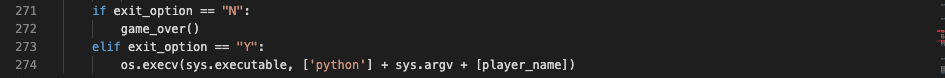
    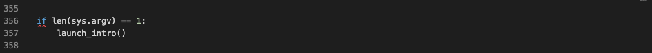

* Coming up with how to create my grid was a challenge! After brainstorming, I researched a few different ways people had achieved this. Some of the tutorials I looked at:
    * [Code Academy](https://discuss.codecademy.com/t/excellent-battleship-game-written-in-python/430605)
    * [Python for beginers](https://bigmonty12.github.io/battleship)        * [Stack Exchange](https://codereview.stackexchange.com/questions/122970/python-simple-battleship-game)
* My peers at Code Institute Slack were also incredibly helpful!
* My mentor Chris helped me better understand how to best validate my code.

* Images & Icons:
    * [Font Awesome](https://fontawesome.com/) for [GitHub Icon](https://fontawesome.com/v5.15/icons/github?style=brands)
    * [Vector Stock](https://www.vectorstock.com/royalty-free-vector/rock-paper-scissors-hand-gesture-vector-25169733) for Rock, Paper, Scissors hand images.
    * [Favicon](https://favicon.io/emoji-favicons/oncoming-fist)
       

